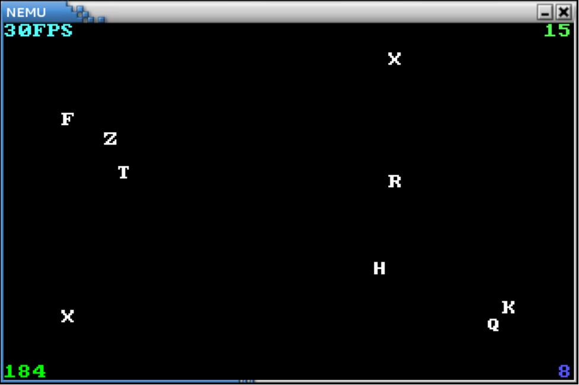

# 输入输出

尽管我们已经实现了若干条指令并运行了`cputest`中的各个测试用例, 可它们只在背后默默计算, 用户什么都看不见. 回想在任何程序设计课上所做的第一件事, 往往都是让计算机输出一句`hello world`. 而实际上, 输入输出是计算机与外界交互的基本手段, 也是计算机必备的基本功能. 

如果你还记得计算机刚启动时执行的BIOS程序的全称是Basic Input/Output System, 你就会理解输入输出对计算机来说是多么重要了.

在真实的计算机中, 输入输出都是由I/O设备完成的，其工作原理很容易理解. 回忆一下数字电路实验中操作过的芯片, 其实I/O设备也一样是个数字电路. 当我们向设备发送一些特定含义的数字信号时，设备就能通过引脚连通的组合得知该如何工作. 等一下, **通过一些信号来指导设备工作**不就类似于**通过程序指令指导CPU工作**吗？

的确, 设备与CPU类似, 同样拥有自己的状态寄存器 (类比CPU寄存器) 和功能部件 (类比运算器) , 当然不同的设备其功能部件各有不同. 例如键盘有一个把按键的模拟信号转换成扫描码的部件, 而[VGA](https://en.wikipedia.org/wiki/Video_Graphics_Array)则有一个把像素颜色信息转换成显示器模拟信号的部件. 



控制设备工作的数字信号称为"命令字", 设备的工作跟CPU执行指令的流程很像, 一样需要接受命令字, 然后译码并执行 ... (你在之前已经完成了CPU整个工作方式, 所以这部分对你来说过于熟悉了). 也许唯一让你觉得神秘的, 就是设备功能部件中模/数 (A/D) 转换, 数模 (D/A) 转换等内部的实现. 本课程中未提供有关它们的实践, 但是你可能会在之后的微机原理与接口技术课程中学习这部分的原理.



我们希望通过操作计算机来控制设备工作, 显然, 这一艰巨的任务又是由CPU来完成. 上面说到, 要控制设备必须发送控制的命令字, 那么, CPU怎么知道向哪个设备发送, 又怎么发送命令字呢？


## I/O编址

根据你的经验，第一个"哪一个"的问题估计跟地址相关. 事实上就是如此. 我们已经知道内存有地址的概念, 那么我们也可以给I/O设备中允许CPU访问的寄存器逐一编址, 从而让CPU区分不同的设备. I/O编址方式有两种, 区别在于I/O端口占不占用存储空间的地址. 

### 端口映射I/O（独立编址）

一种编址方式叫端口映射I/O(port-mapped I/O), 即**在系统中存在了另一种与存储地址无关的I/O地址**, 同时CPU访问设备要使用专门的I/O指令, 设备的地址称为端口号, 在I/O指令中给出端口号, 就能找到访问的设备的寄存器了. 

> 市场上的计算机绝大多数都是IBM PC兼容机, IBM PC兼容机对常见设备端口号的分配有[专门的规定](http://en.wikipedia.org/wiki/Input/output_base_address). 设备中可能会有一些私有寄存器, 它们是由设备自己维护的, 它们没有端口号, CPU不能直接访问它们. 

**x86提供` in `和` out `指令用于访问设备**. 以CPU为主视角, 很容易理解` in `指令是将设备寄存器中的数据传输到CPU寄存器中, 而` out `指令则是将CPU寄存器中的数据传送到设备寄存器中. 



下面是使用` out `指令给串口发送命令字的一个例子, 代码位于` nexus-am/am/arch/x86-nemu/src/trm.c `中的` serial_init() `,

```c
movl $0x0, %al
movl $0x3f9, %edx
outb %al, (%dx)
```

上述代码传送0x0到0x3f9号端口所对应的设备寄存器. 你需要注意到I/O指令和命令字的区别, 前者是CPU执行的指令, 而后者则由设备来解释和执行, 其具体含义与设备相关. 以上述代码为例, CPU将0x0这个数据传送到串口的一个寄存器中, 而串口接收到0x0后解释发现是一条关中断命令, 于是进入关中断状态. 



事实上, 设备的行为都会在相应的文档里面有清晰的定义, 驱动开发者需要阅读设备的相关文档, 编写相应的命令字序列来对设备进行期望的操作. 在PA中我们无需了解这些细节, 只需要知道, 我们可以通过阅读相关文档, 编写相应的程序在CPU上运行来操作设备即可.

### 内存映射I/O（统一编址）

端口映射I/O把端口号作为I/O指令的一部分, 这种方法很简单, 但最大的缺点是指令集为了兼容已经开发的程序, 只能进行添加而不能修改的. 这意味着, 端口映射I/O所能访问的I/O地址空间的大小, 在设计I/O指令的那一刻就已经决定下来了. 所谓I/O地址空间, 其实就是所有能访问的设备的地址的集合. 

随着设备越来越多, 功能也越来越复杂, I/O地址空间有限的端口映射I/O已经逐渐不能满足需求了. 有的设备需要让CPU访问一段较大的连续存储空间, 如VGA的显存, 24色加上Alpha通道的1024x768分辨率的显存就需要3MB的编址范围. 于是内存映射I/O(memory-mapped I/O)应运而生.

内存映射I/O将一部分物理内存"重定向"到I/O地址空间中, **CPU尝试访问这部分物理内存的时候, 实际上最终是访问了相应的I/O设备**. 于是, CPU就可以通过普通的访存指令来访问设备. 这意味着物理内存的地址空间和CPU的位宽都会不断增长, 内存映射I/O从来不需要担心I/O地址空间耗尽的问题. 

内存映射I/O唯一的缺点, 也就是CPU无法通过正常渠道直接访问那些被映射到I/O地址空间的物理内存了. 但随着计算机的发展, 内存映射I/O的唯一缺点已经越来越不明显了: 现代计算机都已经是64位计算机, 物理地址线都有48根, 这意味着物理地址空间有256TB这么大, 划给显存的3MB地址空间就显得微不足道. 

因此, 内存映射I/O成为了现代计算机主流的I/O编址方式: RISC架构只提供内存映射I/O的编址方式, 而PCI-e, 网卡, x86的APIC等主流设备, 都支持通过内存映射I/O来访问.



内存映射I/O的一个例子就是NEMU中的物理地址区间`[0x40000, 0x80000]`. 这段空间被映射到VGA内部的显存, 因此<u>读写这段地址空间即读写VGA显存的数据</u>.例如代码

```c
memset((void *)0x40000, 0, SCR_SIZE);
```

将显存中一个屏幕大小的数据清零, 即往整个屏幕写入黑色像素, 起到清屏作用. 由于内存映射I/O的编程模型和普通编程完全一样, 因此程序员编程时可直接把I/O设备当作内存来访问.





也许你从来都没听说过C语言中有`volatile`这个关键字, 但它从C语言诞生开始就一直存在. `volatile`关键字的作用十分特别, 它的作用是避免编译器对相应代码进行优化. 你应该动手体会一下`volatile`的作用, 在GNU/Linux下编写以下代码:

```c
void fun() {
    volatile unsigned char *p = (void *)0x8048000;
    *p = 0;
    while(*p != 0xff);
    *p = 0x33;
    *p = 0x34;
    *p = 0x36;
}
```

然后使用`-O2`编译代码. 尝试去掉代码中的`volatile`关键字, 重新使用`-O2`编译, 并对比去掉`volatile`前后反汇编结果的不同.

你或许会感到疑惑, 代码优化不是一件好事情吗? 为什么会有`volatile`这种奇葩的存在? 思考一下, 如果代码中的地址`0x8048000`最终被映射到一个设备寄存器, 去掉`volatile`可能会带来什么问题?




## 加入IOE

NEMU框架代码已经提供了设备的一些代码, 位于`nemu/src/device`. 代码模拟了以下模块:

- 两种I/O编址方式: 端口映射I/O和内存映射I/O
- 四种设备: 串口, 时钟, 键盘, VGA

所有设备只实现了在NEMU中用到的功能, 下面我们对代码稍作解释:

- `nemu/src/device/io/port-io.c`是对端口I/O的模拟. 其中`PIO_t`结构用于记录一个端口I/O映射的关系, 设备会初始化时会调用`add_pio_map()`函数来注册一个端口I/O映射关系, 返回该映射关系的I/O空间首地址. `pio_read()`和`pio_write()`是面向CPU的端口I/O读写接口. 由于NEMU是单线程程序, 因此只能串行模拟整个计算机系统的工作, 每次进行I/O读写的时候, 才会调用设备提供的回调函数(callback), 更新设备的状态. 内存映射I/O的模拟和端口I/O的模拟比较相似, 只是内存映射I/O的读写并不是面向CPU的, 这一点会在下文进行说明.
- `nemu/src/device/device.c`含有和SDL库相关的代码, NEMU使用SDL库来模拟计算机的标准输入输出. `init_device()`函数首先对以上四个设备进行初始化, 其中在初始化VGA时还会进行一些和SDL相关的初始化工作, 包括创建窗口, 设置显示模式等. 最后还会注册一个100Hz的定时器, 每隔0.01秒就会调用一次`device_update()`函数. `device_update()`函数主要进行一些设备的模拟操作, 包括以50Hz的频率刷新屏幕, 以及检测是否有按键按下/释放. 需要说明的是, 代码中注册的定时器是虚拟定时器, 它只会在NEMU处于用户态的时候进行计时: 如果NEMU在`ui_mainloop()`中等待用户输入, 定时器将不会计时; 如果NEMU进行大量的输出, 定时器的计时将会变得缓慢. 因此除非你在进行调试, 否则尽量避免大量输出的情况, 从而影响定时器的工作.



要在NEMU中加入IOE, 只需要在`nemu/include/common.h`中定义宏`HAS_IOE`. 定义后, `init_device()`函数会对设备进行初始化. 重新编译后, 你会看到运行NEMU时会弹出一个新窗口, 用于显示下文所述的VGA输出.



另一方面, 我们需要在AM中实现相应的API为程序提供IOE的抽象 (在`nexus-am/am/arch/x86-nemu/src/ioe.c`中定义):

- `_Screen _screen ` 结构体用于指示屏幕的大小.

- `void _ioe_init()` 进行IOE相关的初始化工作, 调用后程序才能正确使用以下IOE相关的API.

  （<u>以下函数等待你的填坑</u>）

- `unsigned long _uptime()` 返回系统启动后经过的毫秒数.

- `void _draw_rect(const uint32_t *pixels, int x, int y, int w, int h)` 将`pixels`指定的矩形像素绘制到屏幕中, 范围为`(x, y)`和`(x+w, y+h)`两点连线作为对角线的矩形区域.

- ~~`void _draw_sync()` 将之前的绘制内容同步到屏幕上~~ (在NEMU中绘制内容总是会同步到屏幕上, 因而无需实现此API).

- `int _read_key() ` 若有按键状态, 返回按键的键盘码; 若无按键状态, 则返回`_KEY_NONE`.



**[阅读建议] 后文对设备的介绍或许会为你理解以上函数提供帮助, 你可以先往下阅读, 再回来补充这里的函数.**

你需要根据本页内容实现相关函数.



### 串口

串口, 是采用[串行通信](https://en.wikipedia.org/wiki/Serial_communication)方式的扩展接口, 这是一种最简单的输出设备. NEMU框架代码模拟了串口的功能, 位于 `nemu/src/device/serial.c`. 代码简化了串口的大部分功能, 保留了数据寄存器和状态寄存器. 串口初始化时会注册`0x3F8`处长度为8个字节的端口作为其寄存器, 但代码中只模拟了其中的两个寄存器的功能. 由于NEMU串行模拟计算机系统的工作, 串口的状态寄存器可以一直处于空闲状态; 每当CPU往数据寄存器中写入数据时, 串口会将数据传送到主机的标准输出.

你会注意到之前提过的`_putc()`函数, 它就是通过串口输出的. 然而我们并未往AM中加入IOE却使用了它, 事实上, AM把`_putc()`放在TRM, 而不是IOE中. 你可能会觉得有些奇怪.

> ```
> AM = TRM + IOE + ASYE + PTE + MPE
> ```

尽管计算理论中提出的最原始的TRM不具有输出的能力, 但输出对于一个现实的计算机系统来说, 是一个最基本的功能. 因此在AM中, `_putc()`的加入让TRM具有输出字符的能力. 被扩充后的TRM更靠近一个实用的机器, 而不再是只会计算的数学模型.

`nexus-am/am/arch/x86-nemu/src/trm.c`中已经提供了串口的功能. 为了让程序使用串口进行输出, 你还需要实现端口映射I/O.



实现`in`, `out`指令, 在它们的helper函数中分别调用`pio_read()`和`pio_write()`函数. 由于NEMU中有一些设备的行为是我们自定义的, 与QEMU中的标准设备的行为不完全一样 (例如NEMU中的串口总是就绪的, 但QEMU中的串口并不是这样), 这导致在NEMU中执行`in`和`out`指令的结果与QEMU可能会存在不可调整的偏差. 为了使得differential testing可以正常工作, 我们在这两条指令中调用了相应的函数来设置`is_skip_qemu`标志, 来跳过与QEMU的检查.

实现后, 在`nexus-am/am/arch/x86-nemu/src/trm.c`中定义宏`HAS_SERIAL`, 然后在`nexus-am/apps/hello`目录下键入

```bash
make run
```

在NEMU中运行基于AM的hello程序. 如果你的实现正确, 你将会看到程序往终端输出了10行`Hello World!` (请注意不要让输出埋没在Log的海洋里).





这个hello程序和我们在程序设计课编程写的第一个Hello World程序一样吗？如果不一样, 它们分别运行在计算机哪个层次中？请结合PA1回忆一下. 



### 时钟

有了时钟, 程序才可以提供时间相关的体验, 例如游戏的帧率, 程序运行的快慢等. `nemu/src/device/timer.c`模拟了i8253计时器的功能. 计时器的大部分功能都被简化, 只保留了"发起时钟中断"的功能(目前我们不会用到). 同时添加了一个自定义的RTC(Real Time Clock), **初始化时将会注册`0x48`处的端口作为RTC寄存器, CPU可以通过I/O指令访问这一寄存器, 获得当前时间**(单位是ms).



实现`_uptime()`后, 在NEMU中运行`timetest`程序 (`nexus-am/tests/timetest`目录下), 编译和运行方式参考上文, 此后不再额外说明. 如果你的实现正确, 你将会看到程序每隔1秒输出一句时间信息.





"native"是指操作系统默认的运行时环境, 例如我们通过`gcc hello.c`编译程序时, 就会编译到GNU/Linux提供的运行时环境. 事实上, native也可以看做一个简单的AM, 目前只支持TRM和IOE. 但很快你就会看到, native也已经可以支撑很多程序的运行了.





有了时钟之后, 我们就可以测试一个程序跑多快, 从而测试计算机的性能. 尝试在NEMU中依次运行以下benchmark(已经按照程序的复杂度排序, 均在`nexus-am/apps`目录下; 另外跑分时请注释掉`nemu/include/common.h`中的`DEBUG`和`DIFF_TEST`宏, 以获得较为真实的跑分):

- dhrystone
- coremark
- microbench

成功运行后会输出跑分. 跑分以`i7-6700 @ 3.40GHz`的处理器为参照, `100000`分表示与参照机器性能相当, `100`分表示性能为参照机器的千分之一. 除了和参照机器比较之外, 也可以和小伙伴进行比较. 如果把上述benchmark编译到native(编译和运行时添加`ARCH=native`参数), 还可以比较native的性能.

另外, microbench提供了两个不同规模的测试集`test`和`ref`. 其中`ref`测试集规模较大, 用于跑分测试, 默认会编译`ref`测试集; `test`测试集规模较小, 用于正确性测试, 需要在运行`make`时显式指定编译`test`测试集:

```bash
make INPUT=TEST
```



### 键盘

键盘是最基本的输入设备. 一般键盘的工作方式如下: 当按下一个键的时候, 键盘将会发送该键的通码(make code); 当释放一个键的时候, 键盘将会发送该键的断码(break code). `nemu/src/device/keyboard.c`模拟了i8042通用设备接口芯片的功能. 其大部分功能也被简化, 只保留了键盘接口. **i8042初始化时会注册`0x60`处的端口作为数据寄存器, 注册`0x64`处的端口作为状态寄存器**. 每当用户敲下/释放按键时, 将会把相应的键盘码放入数据寄存器, 同时把状态寄存器的标志设置为`1`, 表示有按键事件发生. CPU可以通过端口I/O访问这些寄存器, 获得键盘码. 在AM中, 我们约定通码的值为`断码 + 0x8000`.



在游戏中, 很多时候需要判断玩家是否同时按下了多个键, 例如RPG游戏中的八方向行走, 格斗游戏中的组合招式等等. 根据键盘码的特性, 你知道这些功能是如何实现的吗?





实现`_read_key()`函数后, 在NEMU中运行`keytest`程序(在`nexus-am/tests/keytest`目录下). 如果你的实现正确, 在程序运行时弹出的新窗口中按下按键, 你将会看到程序输出相应的按键信息.



### VGA

VGA可以用于显示颜色像素, 是最常用的输出设备. `nemu/src/device/vga.c`模拟了VGA的功能. **VGA初始化时注册了从`0x40000`开始的一段用于映射到video memory的物理内存**. 在NEMU中, video memory是唯一使用内存映射I/O方式访问的I/O空间. 代码只模拟了`400x300x32`的图形模式, 一个像素占32个bit的存储空间, R(red), G(green), B(blue), A(alpha)各占8 bit, 其中VGA不使用alpha的信息. 如果你对VGA编程感兴趣, [这里](http://www.osdever.net/FreeVGA/home.htm)有一个名为FreeVGA的项目, 里面提供了很多VGA的相关资料.



现代的显示器一般都支持24位的颜色(R, G, B各占8个bit, 共有 `2^8*2^8*2^8` 约1600万种颜色), 为了让屏幕显示不同的颜色成为可能, 在8位颜色深度时会使用调色板的概念. 调色板是一个颜色信息的数组, 每一个元素占4个字节, 分别代表R(red), G(green), B(blue), A(alpha)的值. 引入了调色板的概念之后, 一个像素存储的就不再是颜色的信息, 而是一个调色板的索引: 具体来说, 要得到一个像素的颜色信息, 就要把它的值当作下标, 在调色板这个数组中做下标运算, 取出相应的颜色信息. 因此, 只要使用不同的调色板, 就可以在不同的时刻使用不同的256种颜色了.

在一些90年代的游戏中, 很多渐出渐入效果都是通过调色板实现的, 你知道其中的玄机吗?





在`paddr_read()`和`paddr_write()` (位于`nemu/src/memory/memory.c`) 中加入对内存映射I/O的判断. 通过`is_mmio()`函数判断一个物理地址是否被映射到I/O空间, 如果是, `is_mmio()`会返回映射号, 否则返回`-1`. 内存映射I/O的访问需要调用`mmio_read()`或`mmio_write()`, 调用时需要提供映射号. 如果不是内存映射I/O的访问, 就访问`pmem`.

实现后, 在NEMU中运行`videotest`程序 (在`nexus-am/tests/videotest`目录下). 如果内存映射I/O实现正确, 你会看到新窗口中输出了一些颜色信息.





事实上, 刚才输出的颜色信息并不是`videotest`应该输出的画面, 这是因为框架代码中的`_draw_rect()`并未正确实现其功能. 你需要实现正确的`_draw_rect()`. 实现后, 在NEMU中重新运行`videotest`. 如果你的实现正确, 你将会看到新窗口中输出了斑斓的动画效果.



------

## 冯诺依曼计算机系统

在NEMU和AM中都完整实现IOE后,  我们这台计算机系统终于像模像样, 可以进行一些有趣的操作了.



运行打字小游戏(在`nexus-am/apps/typing`目录下). 打字小游戏来源于2013年NJUCS oslab0的框架代码. 为了配合移植, 代码的结构做了少量调整, 同时去掉了和显存优化相关的部分, 并去掉了浮点数.





有兴趣的同学可以尝试在NEMU中运行litenes(在`nexus-am/apps/litenes`目录下). 没错, 我们在PA1的开头给大家介绍的红白机模拟器, 现在也已经可以在NEMU中运行起来了!

事实上, 我们在不知不觉中已经实现了一个冯诺依曼计算机系统! 你已经在导论课上学习到, 冯诺依曼计算机系统由5个部件组成: 运算器, 控制器, 存储器, 输入设备和输出设备, 而你已经在NEMU中把它们都实现了. 再回过头来审视这一既简单又复杂的计算机系统: 说它简单, 它只不过在TRM的基础上添加了IOE, 本质上还是"取指->译码->执行"的工作方式, 甚至只要具备一些数字电路的知识就可以理解构建计算机的可能性; 说它复杂, 它却已经足够强大来支撑这么多精彩纷呈的程序. 那些看似简单但又可以折射出无限可能的事物, 其中承载的美妙规律容易使人们为之陶醉, 为之折服. 计算机, 就是其中之一.



你需要在实验报告中用自己的语言, 尽可能详细地回答下列问题.

- <u>编译与链接Ⅰ</u> 

  在`nemu/include/cpu/rtl.h`中, 你会看到由`static inline`开头定义的各种RTL指令函数. 选择其中一个函数, 分别尝试去掉`static`, 去掉`inline`或去掉两者, 然后重新进行编译, 你会看到发生错误. 请分别解释为什么会发生这些错误? 你有办法证明你的想法吗?

- <u>编译与链接Ⅱ</u>

  1. 在`nemu/include/common.h`中添加一行`volatile static int dummy;` 然后重新编译NEMU. 请问重新编译后的NEMU含有多少个`dummy`变量的实体? 你是如何得到这个结果的?
  2. 添加上题中的代码后, 再在`nemu/include/debug.h`中添加一行`volatile static int dummy;` 然后重新编译NEMU. 请问此时的NEMU含有多少个`dummy`变量的实体? 与上题中`dummy`变量实体数目进行比较, 并解释本题的结果.
  3. 修改添加的代码, 为两处`dummy`变量进行初始化:`volatile static int dummy = 0;` 然后重新编译NEMU. 你发现了什么问题? 为什么之前没有出现这样的问题? (回答完本题后可以删除添加的代码)

- <u>I/O端口与接口</u>

  1. 假如采用端口映射I/O的编址方式下, I/O端口的地址从0000H开始, 系统板保留1K个I/O端口, 那么系统I/O地址的范围是多少? 假如总共采用16条地址线编址, 用户设计扩展接口时可以使用的端口的地址范围是多少? 请给出答案和解析。
  2. 你能想到有什么来自CPU的信号参与了设备的选通或控制吗? 在这过程中CPU和设备传输了哪几种类型的信息? 请举一个常见的设备例子进行说明. 

//我真的想不出I/O别的题了Q.Q

